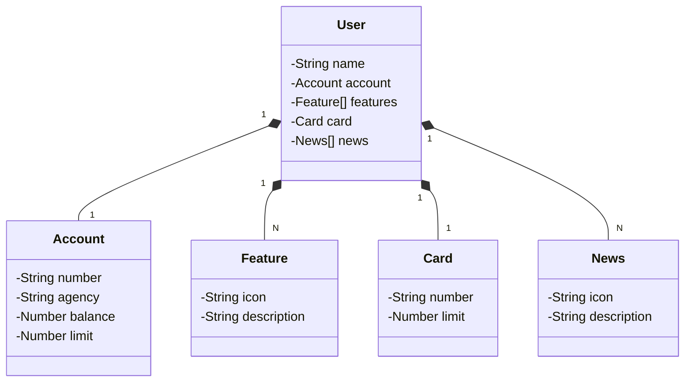

# 📊 BankingAPI

Este projeto é uma API financeira desenvolvida em Java utilizando o framework Spring Boot. A API gerencia usuários, contas, cartões, notícias e funcionalidades.

## 🚀 Tecnologias Utilizadas

- **Java**: Linguagem de programação principal.
- **Spring Boot**: Framework para desenvolvimento de aplicações Java.
- **Gradle**: Ferramenta de automação de build.
- **PostgreSQL**: Sistema de gerenciamento de banco de dados relacional.
- **H2**: Banco de dados em memória para testes e desenvolvimento.
- **Swagger**: Ferramenta para documentar e testar APIs REST.

## 📝 Sobre

BankingAPI é uma API financeira desenvolvida utilizando Java e o framework Spring Boot. A API oferece uma série de funcionalidades para gerenciar usuários, contas, cartões, notícias e funcionalidades personalizadas.

Esta aplicação foi desenvolvida como um estudo do uso das ferramentas e tecnologias mencionadas, incluindo Java, Spring Boot, Gradle, PostgreSQL, H2 e Swagger. É uma oportunidade para explorar e aprender mais sobre o desenvolvimento de APIs e o gerenciamento de dados.

#### 🌟 Funcionalidades

* Gerenciamento de Usuários: Criação, atualização, exclusão e consulta de usuários, com suporte para buscas avançadas.
* Gerenciamento de Contas: Criação, atualização e consulta de contas bancárias associadas aos usuários.
* Gerenciamento de Cartões: Acesso e atualização das informações de cartões dos usuários.
* Gerenciamento de Funcionalidades: Adição e visualização de funcionalidades personalizadas associadas aos usuários.
* Gerenciamento de Notícias: Adição e visualização de notícias associadas aos usuários (funcionalidade ainda em desenvolvimento).

## 🗂️ Estrutura do Projeto

A estrutura do projeto é organizada nas seguintes pastas:

- **`model`**: Contém as classes de domínio (`User`, `Account`, `Feature`, `Card`, `News`).
- **`controller`**: Contém os controladores REST que expõem os endpoints da API.
- **`repository`**: Contém as interfaces de repositório para acessar o banco de dados.
- **`services`**: Contém a lógica de negócios.
- **`exceptions`**: Contém as classes de tratamento de exceções.

## 📈 Diagrama de Classes



## 🌐 Endpoints da API

### 🧑 User Endpoints

- **Get All Users**
  - **Método**: `GET`
  - **URL**: `/users`
  - **Descrição**: Retorna uma lista de todos os usuários.

- **Create User**
  - **Método**: `POST`
  - **URL**: `/users`
  - **Descrição**: Cria um novo usuário com as informações fornecidas.

- **Create All Users**
  - **Método**: `POST`
  - **URL**: `/users/createusers`
  - **Descrição**: Cria uma lista de usuários.

- **Get User by ID**
  - **Método**: `GET`
  - **URL**: `/users/{id}`
  - **Descrição**: Retorna as informações de um usuário específico com base no ID.

- **Update User**
  - **Método**: `PUT`
  - **URL**: `/users/{id}`
  - **Descrição**: Atualiza as informações de um usuário específico com base no ID.

- **Delete User**
  - **Método**: `DELETE`
  - **URL**: `/users/{id}`
  - **Descrição**: Remove um usuário específico com base no ID.

- **Search Users**
  - **Método**: `GET`
  - **URL**: `/users/search`
  - **Descrição**: Permite buscar usuários com base em parâmetros de consulta, como nome e email.

### 🏦 Account Endpoints

- **Get All Accounts**
  - **Método**: `GET`
  - **URL**: `/accounts`
  - **Descrição**: Retorna uma lista de todas as contas.

- **Get Account by Account ID**
  - **Método**: `GET`
  - **URL**: `/accounts/{id}`
  - **Descrição**: Retorna as informações de uma conta específica com base no ID.

- **Get Account by Number**
  - **Método**: `POST`
  - **URL**: `/accounts`
  - **Descrição**: Retorna as informações de uma conta específica com base no número da conta.

- **Update Account**
  - **Método**: `PUT`
  - **URL**: `/accounts/{id}`
  - **Descrição**: Atualiza as informações de uma conta específica com base no ID.

### 🛠️ Feature Endpoints

- **Get Features**
  - **Método**: `GET`
  - **URL**: `/features`
  - **Descrição**: Retorna todas as features cadastradas no sistema.

- **Get Feature**
  - **Método**: `GET`
  - **URL**: `/features/{featureId}`
  - **Descrição**: Retorna uma feature específica.

- **Get User Features**
  - **Método**: `GET`
  - **URL**: `/features/user/{userId}`
  - **Descrição**: Retorna todas as features associadas a um usuário.

- **Add Feature to User**
  - **Método**: `POST`
  - **URL**: `/features/user/{userId}/`
  - **Descrição**: Adiciona uma nova feature para um usuário.

### 💳 Card Endpoints

- **Get User Card**
  - **Método**: `GET`
  - **URL**: `/users/{userId}/card`
  - **Descrição**: Retorna as informações do cartão de um usuário específico.

- **Update User Card**
  - **Método**: `PUT`
  - **URL**: `/users/{userId}/card`
  - **Descrição**: Atualiza as informações do cartão de um usuário específico.

### 📰 News Endpoints

- **Get User News**
  - **Método**: `GET`
  - **URL**: `/users/{userId}/news`
  - **Descrição**: Retorna todas as notícias associadas a um usuário.

- **Add News to User**
  - **Método**: `POST`
  - **URL**: `/users/{userId}/news`
  - **Descrição**: Adiciona uma nova notícia para um usuário.

## 📚 Documentação Swagger

A documentação da API pode ser acessada através do Swagger UI, disponível na seguinte URL após iniciar a aplicação:

```
http://localhost:8080/swagger-ui/
```

## ⚙️ Instalação e Configuração

1. Clone o repositório:
   ```sh
   git clone https://github.com/jady-lima/BankingAPI.git
   ```

2. Navegue até o diretório do projeto:
   ```sh
   cd banking_api
   ```

3. Compile e execute o projeto usando Gradle:
   ```sh
   ./gradlew bootRun
   ```

4. Acesse a aplicação no navegador:
   ```
   http://localhost:8081
   ```

## 🤝 Contribuições

Contribuições são bem-vindas! Sinta-se à vontade para abrir issues e pull requests.

## 🤖 Geração de Documentação com IA Generativa

Para facilitar a criação e manutenção da documentação, este projeto fez uso de IA generativa para gerar e atualizar a documentação da API.
